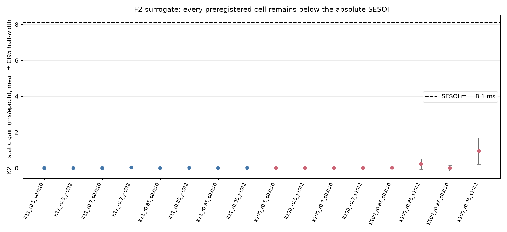

# F2 — Khoảng cách có tồn tại trong surrogate PSA không?

> Exploratory/feasibility, ngày 2026-09-26. SESOI khóa tại commit `504677e`; tiền đăng ký và control khóa tại
> `e2de7aa`, trước lần chạy grid. Đây là surrogate định hướng, không phải claim RQ1/RQ2.

## 1. Câu hỏi và tiền đăng ký

F2 hỏi ngưỡng tĩnh tốt nhất thua oracle K2 bao nhiêu ms và có vượt đồng thời `m=8,1 ms` cùng `10%` headroom không.
Tiền đăng ký dự đoán K=11 và tải `≤0,7` không đáng kể; tín hiệu tập trung ở K=100/tải cao; P1 không đáng kể;
P2 có ý nghĩa trong surrogate; bỏ nhiễu tăng gap, bỏ tuổi giảm gap; `self_gap_twin` xếp hạng tốt nhất.

## 2. Surrogate và giới hạn

Hai tải OU độc lập được đo bằng cửa sổ Poisson. Delay thật là PSA của M/D/1/K dọc khoảng giữ, có trọng số acceptance.
Luật tĩnh được tune theo trễ trải qua `J` và harm thực, rồi tạo quỹ đạo tham chiếu chung. Oracle bin học `Ī,p−` dọc
chính quỹ đạo đó. PSA bỏ bộ nhớ hàng đợi: đặc biệt tại P2, `P(ρ>1)≈31%` và `Π_relax≈2,4`, nó có thể coi buffer
đầy tức thì trong burst ngắn. Vì vậy phán quyết tại P2 phải được kiểm bằng DES ở L1.7.

## 3. Hai lỗi mà đối chứng bắt được

Tune static bằng gain trên quỹ đạo riêng thưởng cho việc nấn ná ở path tệ; tune đúng phải tối thiểu `J`. Ngoài ra,
path hiện tại do luật trước chọn mang thông tin lịch sử. Nested MC chỉ dùng cửa sổ mới nhất lệch
`−0,727±0,137 ms` và đánh giá harm `0,0657` so với thực `0,0997`; oracle bin dọc tham chiếu cho lệch
`+0,034±0,141 ms` và harm `0,0345` so với `0,0342±0,0052`.

## 4. Kết quả lưới c=0

Không ô nào vượt sàn tuyệt đối. Gap lớn nhất là `0,957±0,736 ms` tại `K=100, ρ̄=0,95, σ=0,10, τ=2 s`, chỉ
khoảng 2,4% headroom `39,943 ms`. Ô kế tiếp là `0,222±0,290 ms` tại K=100, tải 0,85 cùng bộ tải. Tất cả K=11
đều có gap không quá `0,028 ms`; mọi ô tải `≤0,7` cũng gần 0. Các ô có `frac_harm_possible<2α` được xem là nơi
ràng buộc hầu như không cắn; điều này xảy ra rõ nhất tại tải 0,5 với bộ `σ=0,03,τ=10`.

| Ô chính | gap ± CI half-width | headroom | D_abs | D_rel | Kết luận |
|---|---:|---:|---:|---:|---|
| P1 base | −0,000 ± 0,002 ms | 0,290 ms | −8,100 ± 0,002 | −0,029 ± 0,002 | Không đáng kể |
| P2 base | +0,358 ± 0,751 ms | 38,293 ms | −7,742 ± 0,751 | −3,471 ± 0,724 | Không đáng kể |

Kết quả đầy đủ gồm mọi `c` nằm trong `experiments/results/f02/f02_results.json`; stdout lưới nằm cạnh file này.

## 5. Biến thể P1/P2

P1 luôn gần 0. Tại P2, base là `0,358±0,751 ms`; bỏ nhiễu (`age_only`) tăng lên `1,413±0,594 ms`; bỏ tuổi
(`noise_only`) cũng tăng lên `1,063±0,809 ms`; control bằng 0. Cả bốn vẫn không đáng kể. Hai cơ chế không cộng tuyến
đơn giản: khi cùng tồn tại, selection/tuning và thông tin quan sát làm gap nhỏ hơn từng biến thể riêng.

## 6. Chỉ số H2

Spearman qua 16 ô: `self_gap_twin=0,665`, `sd_log_s_cond=0,524`, `rd_score=0,132`. Dự đoán chỉ số chính đúng,
nhưng `rd_score` kém hơn dự kiến. Một lần chạy đầu tạo `NaN` ở `rd_score` phụ với `c=0,25S` khi mảng hạng hằng;
quy ước suy biến được sửa thành 0 rồi chạy lại cùng seed. Gap và phán quyết không đổi; JSON cuối không có non-finite.

## 7. So với dự đoán và quyết định

Dự đoán K=11, tải thấp, bộ tải mạnh hơn và thứ hạng `self_gap_twin` đều đúng. Dự đoán P2 có ý nghĩa sai: ngay cả
gap lớn nhất trên lưới cũng thấp hơn m hơn bảy lần. Dự đoán bỏ tuổi làm giảm gap cũng sai; nó làm gap tăng.

Theo quy tắc đã đăng ký, kết quả hướng tới **PIVOT: ngưỡng tĩnh đủ trong miền surrogate đã kiểm, và vì sao**.
Đây chưa phải kết luận cuối: L1.7 phải so PSA với DES tại P2, kiểm hướng/mức sai lệch và xác nhận rằng kết quả âm
không phải artefact của surrogate. Không thay SESOI, không chọn lại ô chính và không nâng F2 thành bằng chứng confirmatory.

## Đính chính 2026-09-26 (sau f02b/f02c; phán quyết không đổi)

- §5, §7: **rút lại** “bỏ tuổi làm gap tăng”, “dự đoán bị bác bỏ” và “hai cơ chế không cộng tuyến”. Các biến thể
  dùng luồng ngẫu nhiên khác nhau. Với CRN, hiệu paired là `+0,147±0,546` và `+0,182±0,937 ms`: không phân biệt
  được. Dự đoán chưa được kiểm, không phải bị bác bỏ. `noise_only` còn `z_eff=0,5 s`, không phải tuổi 0.
- §4: 13/16 ô lưới có trần chặt `<m`; phán quyết ở các ô đó là hệ quả của cận trên, không phải bằng chứng so sánh.
- §6: `Spearman(self_gap_twin,headroom)=0,759` lớn hơn `Spearman(self_gap_twin,gap)=0,665`; chuẩn hoá theo
  headroom còn `0,418`. Không dùng làm bằng chứng chọn K17 cho tới khi kiểm trên gap chuẩn hoá, chỉ trong ô kiểm được.
